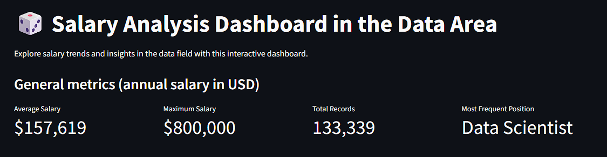
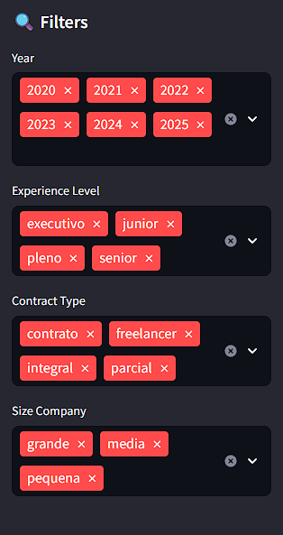
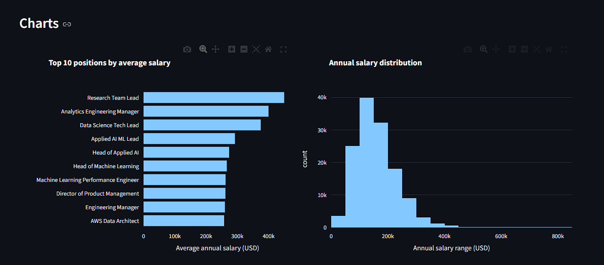
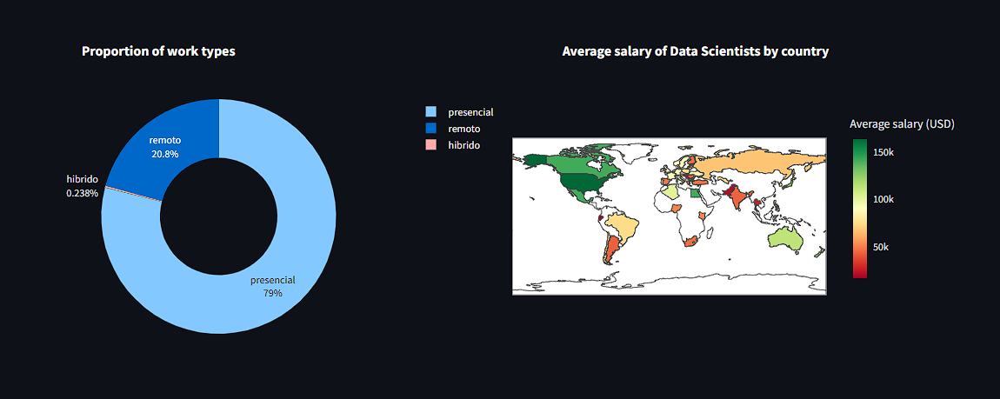

📊 Data Analysis Studies (Python)

https://data-analysis-studies-ess5whguxk6usomitnajt6.streamlit.app/

A collection of Python data analysis experiments and utilities to support learning, experimentation, and practical application of data manipulation and visualization techniques.

📌 About

This project aims to showcase practical data analysis techniques using Python. It includes scripts (such as app.py) that demonstrate real workflows using libraries like pandas, NumPy, and others for loading and working with datasets. The goal is both educational and practical — helping users learn by example and apply data analysis methods to their own data.

⭐ Features

✔ Examples of Python data analysis patterns
✔ Data cleaning & transformation
✔ Visualization of results
✔ Reusable functions for common analysis tasks

📦 Dependencies

This project uses standard Python data libraries such as:

pandas
numpy
matplotlib
seaborn

📊 Python Analysis

This folder contains screenshots of studies in data science with python.

### Dashboard top

### Filters

### Charts

